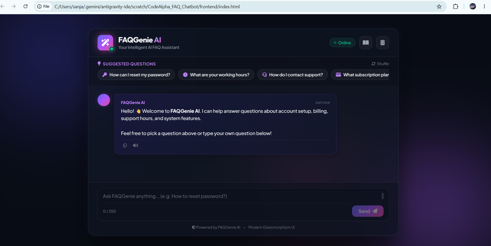
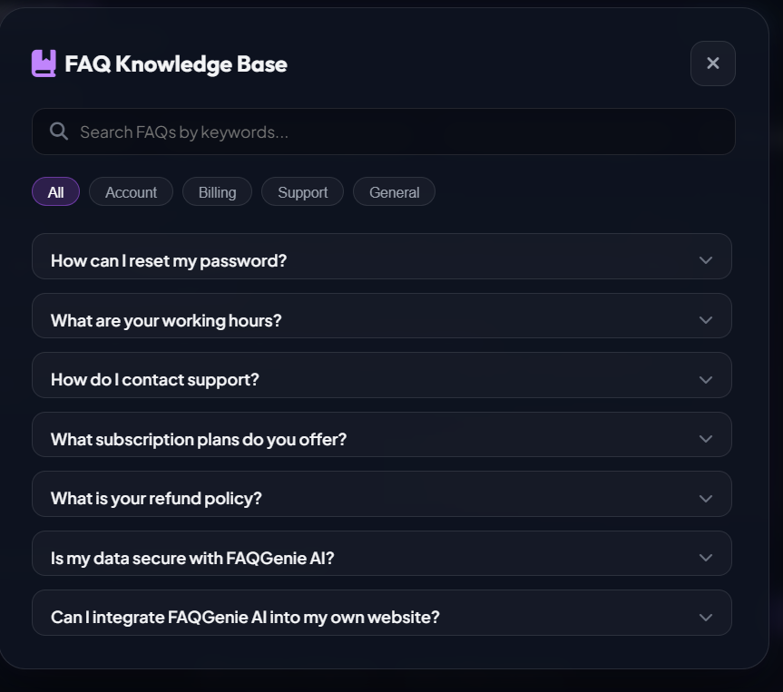
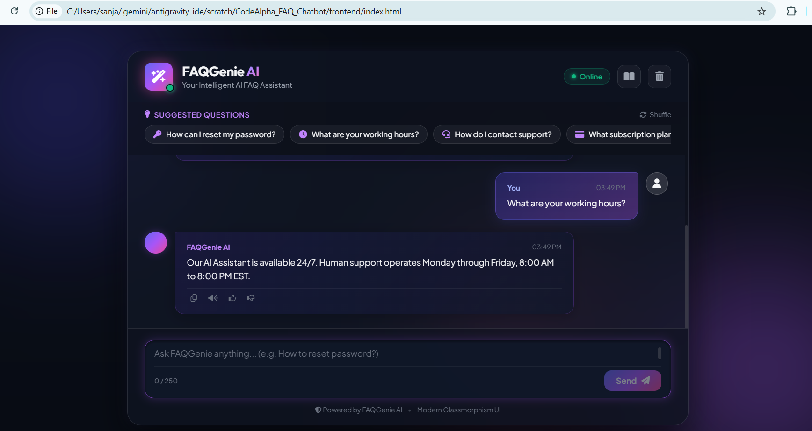
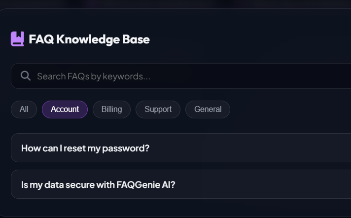
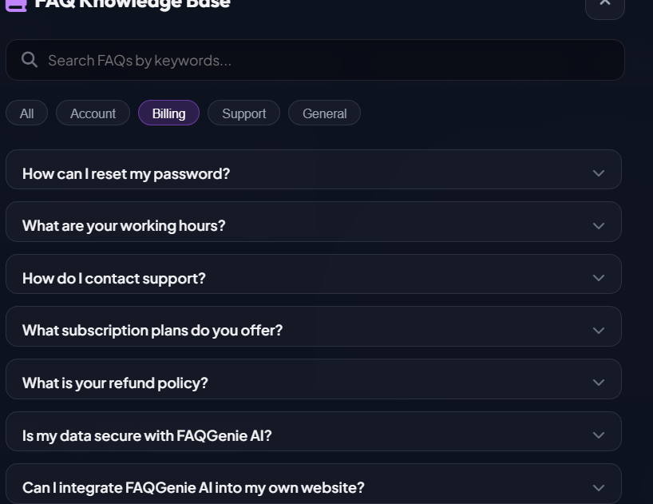
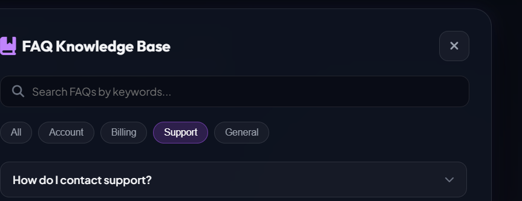
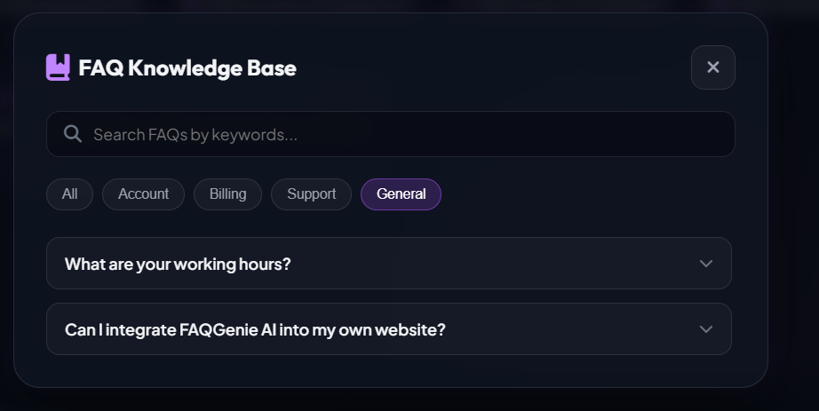
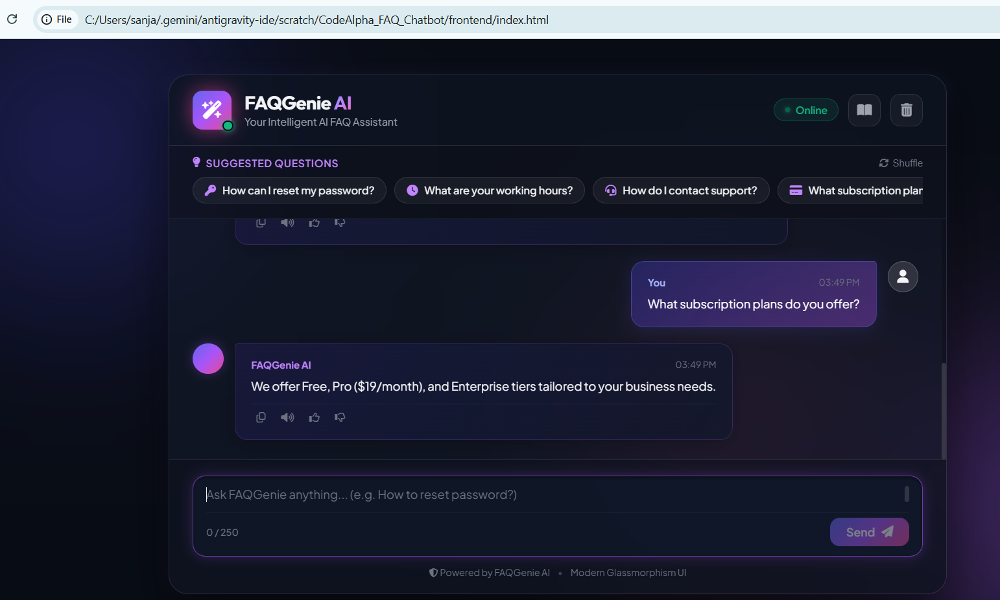
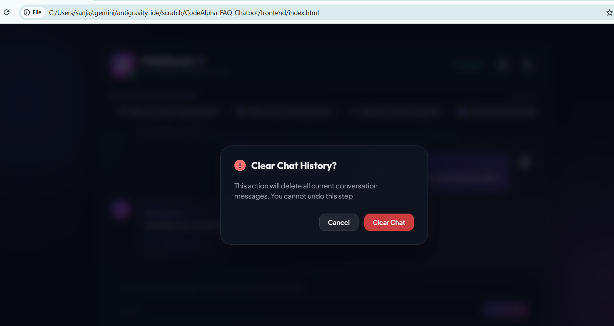
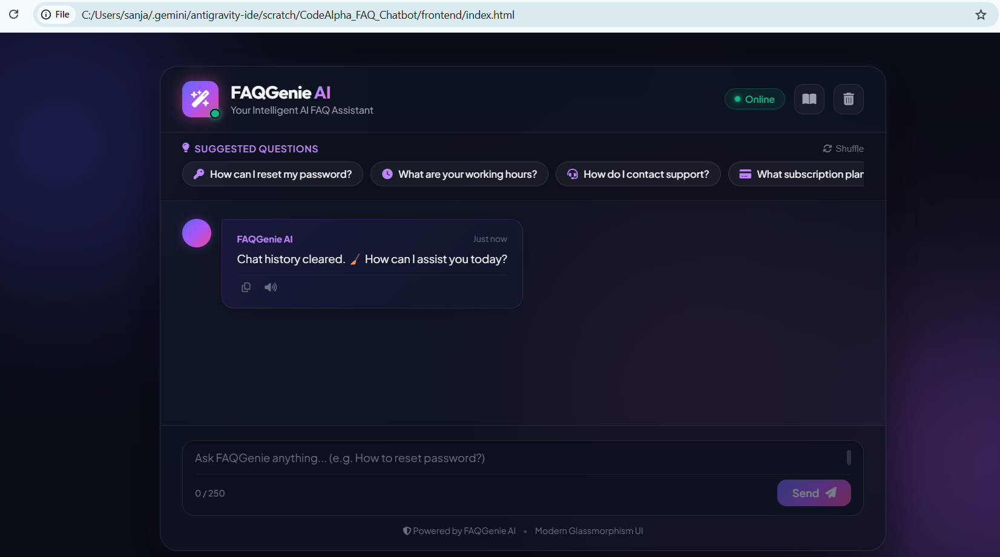

# 🤖 FAQGenie AI – Intelligent FAQ Chatbot

[](https://www.python.org/)
[](https://flask.palletsprojects.com/)
[]()
[](LICENSE)

An intelligent AI-powered FAQ chatbot developed as part of the **CodeAlpha Artificial Intelligence Internship**. The application uses **Natural Language Processing (NLP)** techniques with **TF-IDF Vectorization** and **Cosine Similarity** to understand user questions and return the most relevant FAQ response through a modern glassmorphism chat interface.

---

# ✨ Features

- 🤖 Intelligent FAQ Chatbot
- 🧠 NLP using NLTK
- 📊 TF-IDF Vectorization
- 📐 Cosine Similarity Matching
- 💬 Modern Chat Interface
- ⚡ Flask REST API
- 📚 Searchable Knowledge Base
- 🎤 Speech-to-Text
- 🔊 Text-to-Speech
- 📋 Copy Responses
- 📜 Chat History
- 🧹 Clear Chat Confirmation
- 📱 Responsive Design
- ♿ Accessibility Support

---

# 🛠️ Tech Stack

### Frontend

- HTML5
- CSS3
- JavaScript (ES6)

### Backend

- Python 3.11
- Flask
- Flask-CORS

### NLP

- NLTK
- Scikit-learn
- TF-IDF Vectorizer
- Cosine Similarity

### Dataset

- JSON FAQ Dataset

---

# 📸 Screenshots

## 🏠 Home Page



---

## 💬 Questions & Answers



---

## 🤖 Chatbot Response



---

## 👤 Account Questions



---

## 💳 Billing Questions



---

## 📞 Support Questions



---

## 🌍 General Questions



---

## 📜 Chat History



---

## 🗑️ History Cleared



---

## ✅ Clear History



---

# 📂 Project Structure

```text
CodeAlpha_FAQ_Chatbot/
│
├── backend/
│   ├── app.py
│   ├── chatbot.py
│   ├── config.py
│   ├── utils.py
│   ├── requirements.txt
│   ├── test_app.py
│   ├── data/
│   │   └── faq.json
│   └── services/
│       └── faq_service.py
│
├── frontend/
│   ├── index.html
│   ├── style.css
│   ├── script.js
│   └── assets/
│
├── screenshots/
├── docs/
├── README.md
├── LICENSE
├── .gitignore
└── run.py
```

---

# 🚀 Installation

Clone the repository

```bash
git clone https://github.com/sanjanabhat846/CodeAlpha_FAQ_Chatbot.git
```

Move into the project

```bash
cd CodeAlpha_FAQ_Chatbot
```

Create a virtual environment

```bash
python -m venv venv
```

Activate the environment

### Windows

```bash
venv\Scripts\activate
```

### Linux / macOS

```bash
source venv/bin/activate
```

Install dependencies

```bash
pip install -r backend/requirements.txt
```

---

# ▶️ Run the Project

Start the Flask Backend

```bash
python -m backend.app
```

Open the frontend using any local server or Live Server.

Backend URL

```
http://127.0.0.1:5000
```

Health Endpoint

```
http://127.0.0.1:5000/api/health
```

---

# 📡 API

## POST /api/chat

### Request

```json
{
    "message":"How can I reset my password?"
}
```

### Response

```json
{
    "answer":"Click on the Forgot Password link on the login page to reset your password."
}
```

---

# 📈 Future Enhancements

- 🌐 Multi-language FAQ Support
- 🤖 Gemini / OpenAI Integration
- 📄 PDF Knowledge Base
- 🧠 RAG-based Question Answering
- ☁️ Cloud Deployment
- 👤 User Authentication

---

# 🔗 GitHub Repository

Repository Link:

**https://github.com/sanjanabhat846/CodeAlpha_FAQ_Chatbot**

---

# 👩‍💻 Author

**Sanjana Jairam Bhat**

Artificial Intelligence & Machine Learning Engineering Student

GitHub:

**https://github.com/sanjanabhat846**

---

# 📜 License

This project is licensed under the **MIT License**.

---

# 🙏 Acknowledgements

- CodeAlpha AI Internship
- Flask
- NLTK
- Scikit-learn
- Font Awesome

---

⭐ If you like this project, consider giving it a **Star** on GitHub!