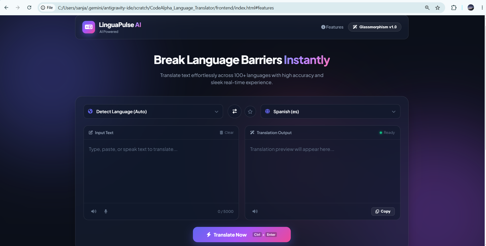
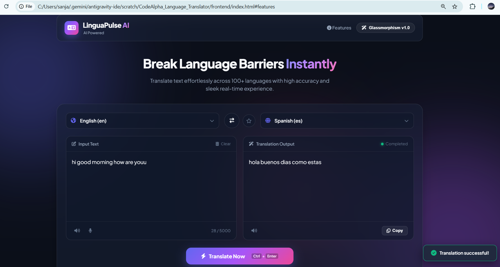
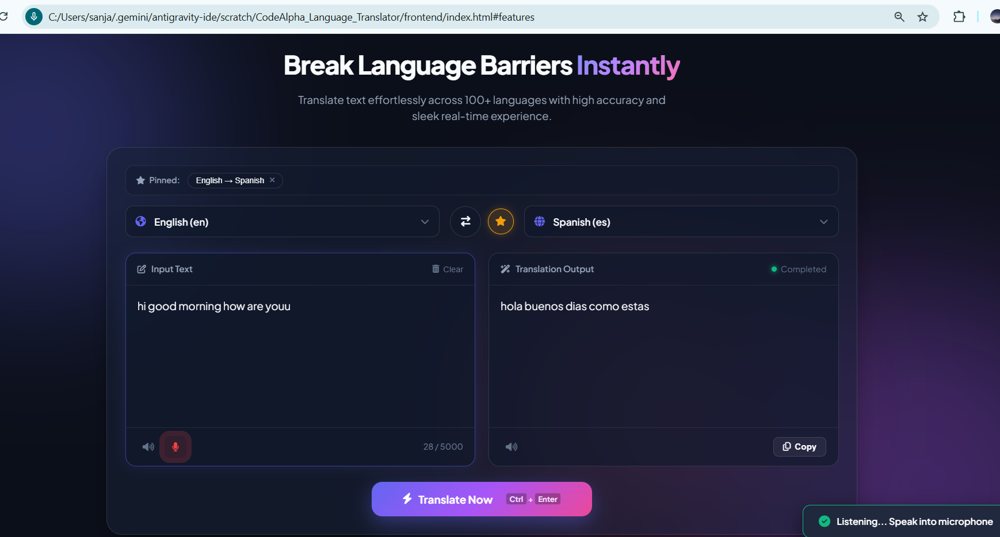
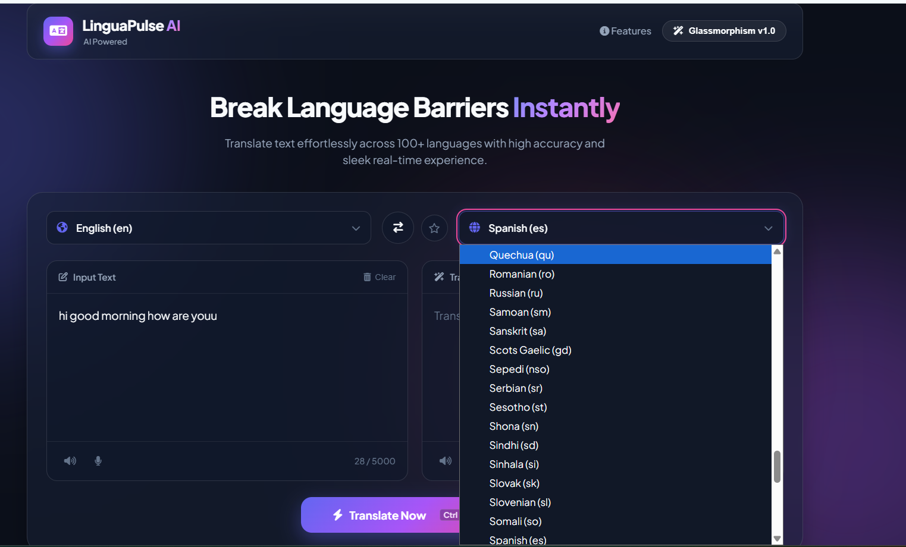
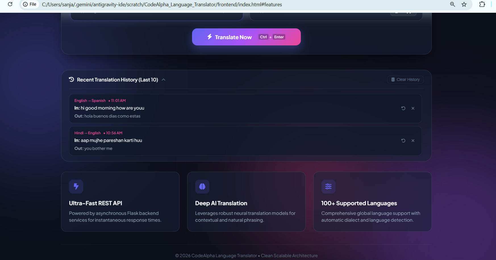

# 🌍 LinguaPulse AI – AI-Powered Language Translator

[](LICENSE)
[](https://www.python.org/)
[](https://flask.palletsprojects.com/)
[]()

A modern AI-powered Language Translator built with **Flask**, **Vanilla JavaScript**, and **deep-translator (Google Translator)**. The application translates text across 100+ languages and includes advanced features like speech recognition, text-to-speech, translation history, favorite language pairs, and a beautiful glassmorphism UI.

---

# ✨ Features

- 🌍 Translate between 100+ languages
- 🤖 Automatic Language Detection
- 🔄 Swap Source & Target Languages
- 🎤 Speech-to-Text (Voice Input)
- 🔊 Text-to-Speech
- ⭐ Favorite Language Pairs
- 📜 Translation History
- 📋 Copy Translation
- ⌨️ Keyboard Shortcut (Ctrl + Enter)
- ⚡ Flask REST API Backend
- 📱 Responsive Glassmorphism UI
- ♿ Accessibility Support

---

# 🖼️ Application Screenshots

## 🏠 Home Screen



---

## 🌍 Successful Translation



---

## ⭐ Favorite Language Pairs



---

## 🌐 Language Selection



---

## 📜 Translation History



---

# 📁 Project Structure

```text
CodeAlpha_Language_Translator/
│
├── backend/
│   ├── app.py
│   ├── config.py
│   ├── translator.py
│   ├── utils.py
│   ├── requirements.txt
│   └── services/
│       └── translation_service.py
│
├── frontend/
│   ├── index.html
│   ├── style.css
│   ├── script.js
│   ├── assets/
│   └── sounds/
│
├── screenshots/
├── docs/
├── README.md
├── LICENSE
├── .gitignore
└── run.py
```

---

# 🛠️ Tech Stack

### Frontend

- HTML5
- CSS3
- JavaScript (ES6)
- Glassmorphism UI

### Backend

- Python
- Flask
- Flask-CORS
- deep-translator

### APIs & Libraries

- Google Translate (deep-translator)
- Web Speech API
- SpeechSynthesis API

---

# 🚀 Installation

## Clone Repository

```bash
git clone https://github.com/sanjanabhat846/CodeAlpha_Language_Translator.git
```

Move into the project folder

```bash
cd CodeAlpha_Language_Translator
```

Create a virtual environment

```bash
python -m venv venv
```

Activate virtual environment

### Windows

```bash
venv\Scripts\activate
```

### Linux / macOS

```bash
source venv/bin/activate
```

Install dependencies

```bash
pip install -r backend/requirements.txt
```

---

# ▶️ Run the Application

Start the Flask Backend

```bash
python -m backend.app
```

The backend runs at:

```
http://127.0.0.1:5000
```

Serve the Frontend

```bash
cd frontend
python -m http.server 5500
```

Open your browser:

```
http://127.0.0.1:5500
```

---

# 📡 API Endpoints

| Method | Endpoint | Description |
|---------|----------|-------------|
| GET | `/` | API Home |
| GET | `/health` | Health Check |
| GET | `/languages` | Supported Languages |
| POST | `/translate` | Translate Text |

### Sample Request

```json
{
    "text": "Hello",
    "source": "en",
    "target": "fr"
}
```

### Sample Response

```json
{
    "translated_text": "Bonjour"
}
```

---

# 🎯 Future Enhancements

- 📄 PDF Translation
- 🖼️ OCR Image Translation
- 📂 Translation Export
- ☁️ Cloud Deployment
- 👤 User Authentication
- 🌐 AI Context-Aware Translation

---

# 👩‍💻 Author

**Sanjana Jairam Bhat**

- 🎓 AIML Engineering Student
- 💻 Passionate about AI, Machine Learning & Full Stack Development

**GitHub**

https://github.com/sanjanabhat846

---

# 📜 License

This project is licensed under the **MIT License**.

---

# 🙏 Acknowledgements

- CodeAlpha AI Internship
- Flask
- Google Translate
- deep-translator
- Web Speech API
- Font Awesome

---

⭐ If you found this project useful, consider giving it a **star** on GitHub!