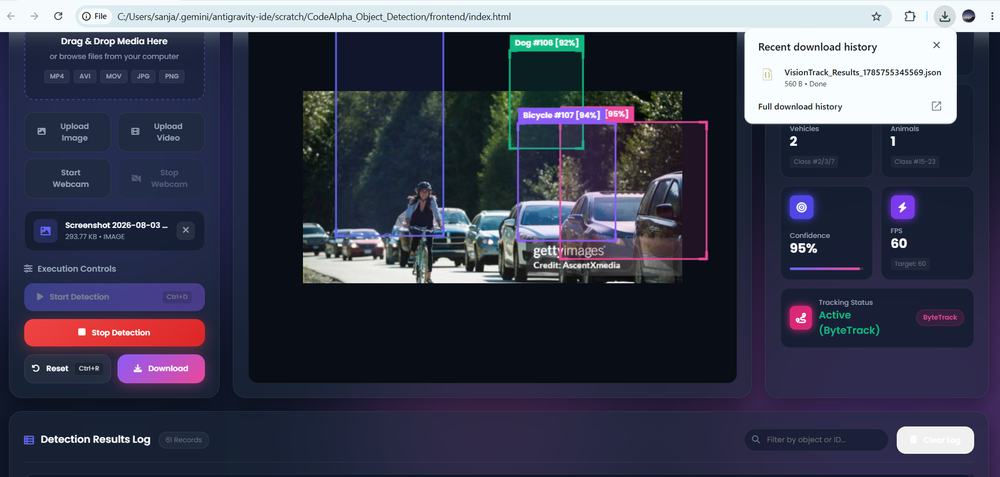
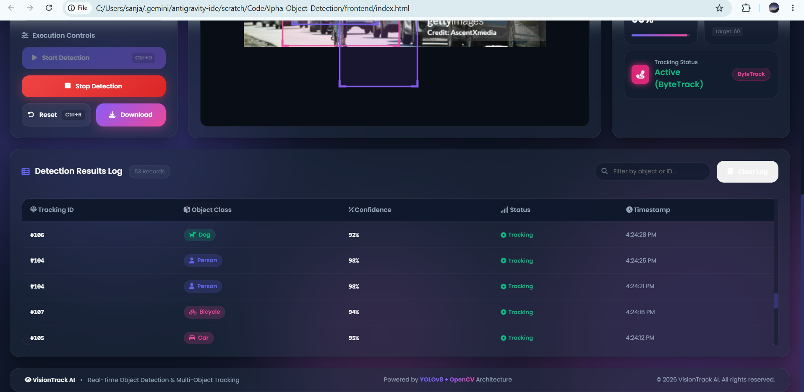
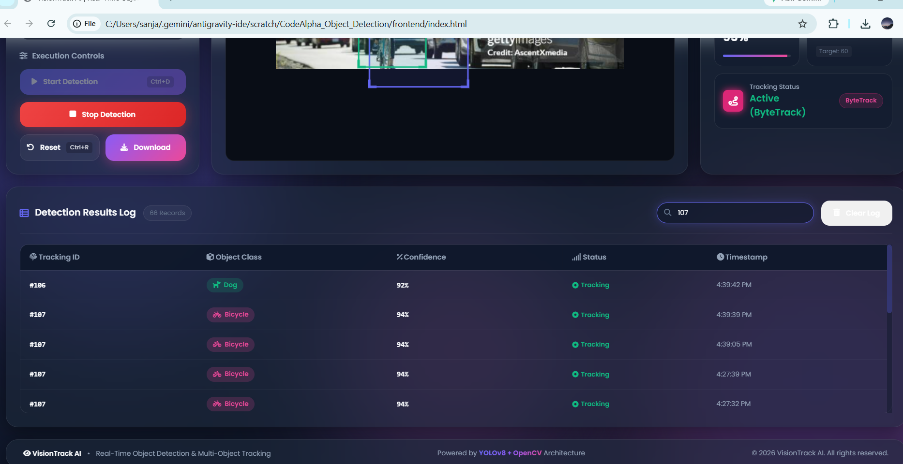
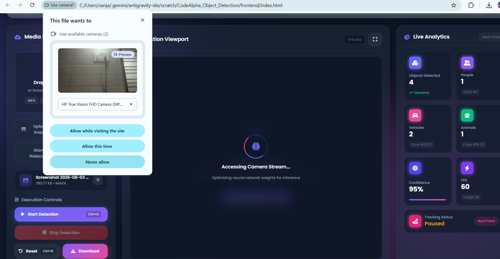

# 👁️ VisionTrack AI - Real-Time Object Detection & Tracking

[](https://www.python.org/)
[](https://flask.palletsprojects.com/)
[](https://opencv.org/)
[](https://github.com/ultralytics/ultralytics)
[](LICENSE)

A modern AI-powered Object Detection & Tracking web application built using **YOLOv8**, **OpenCV**, **Flask**, and a premium **Glassmorphism UI**. The application performs real-time object detection on images and videos while displaying detection statistics and tracking information through an interactive dashboard.

---

# 🚀 Features

- 📷 Image Object Detection
- 🎥 Video Object Detection
- 🎯 YOLOv8 Object Recognition
- 📊 Live Detection Statistics
- 🏷️ Confidence Score Display
- 📋 Detection Results Log
- 🎥 Webcam Support
- 📥 Download Detection Results
- 🌐 REST API Backend
- 💎 Modern Glassmorphism Interface
- ⚡ Responsive Design

---

# 🛠️ Tech Stack

## Frontend
- HTML5
- CSS3
- JavaScript

## Backend
- Python
- Flask
- Flask-CORS

## AI & Computer Vision
- YOLOv8 (Ultralytics)
- OpenCV
- NumPy
- Pillow

---

# 📂 Project Structure

```text
CodeAlpha_Object_Detection/
│
├── backend/
│   ├── app.py
│   ├── detector.py
│   ├── tracker.py
│   ├── config.py
│   ├── utils.py
│   ├── requirements.txt
│   ├── services/
│   ├── uploads/
│   ├── outputs/
│   └── models/
│
├── frontend/
│   ├── index.html
│   ├── style.css
│   ├── script.js
│   └── assets/
│
├── screenshots/
├── docs/
├── README.md
├── LICENSE
├── run.py
└── .gitignore
```

---

# 📸 Application Screenshots

## 🏠 Home Dashboard



---

## 🎯 Object Detection



---

## 🔍 Detection Log Filtering



---

## 📹 Webcam Detection



---

# ⚙️ Installation

## Clone Repository

```bash
git clone https://github.com/sanjanabhat846/CodeAlpha_Object_Detection.git
cd CodeAlpha_Object_Detection
```

## Install Dependencies

```bash
pip install -r backend/requirements.txt
```

---

# ▶️ Run Application

```bash
python -m backend.app
```

Server starts at

```
http://127.0.0.1:5000
```

---

# 🌐 API Endpoints

| Method | Endpoint | Description |
|---------|----------|-------------|
| GET | `/` | API Information |
| GET | `/api/health` | Health Check |
| POST | `/api/detect/image` | Detect Objects in Image |
| POST | `/api/detect/video` | Detect Objects in Video |
| POST | `/api/webcam/start` | Start Webcam |
| POST | `/api/webcam/stop` | Stop Webcam |

---

# 🧠 AI Model

This project uses **YOLOv8 Nano (Ultralytics)** for fast and accurate object detection.

Supported objects include:

- Person
- Car
- Bicycle
- Dog
- Cat
- Bus
- Truck
- Bottle
- Chair
- Laptop

...and many more COCO dataset classes.

---

# 📈 Future Improvements

- ByteTrack Integration
- DeepSORT Tracking
- Live Webcam Detection
- Object Counting Analytics
- Custom Model Training
- Export Detection Reports
- Multi-Camera Support

---

# 👩‍💻 Developer

**Sanjana Bhat**

GitHub:

https://github.com/sanjanabhat846

Project Repository:

https://github.com/sanjanabhat846/CodeAlpha_Object_Detection

---

# 📄 License

This project is licensed under the MIT License.